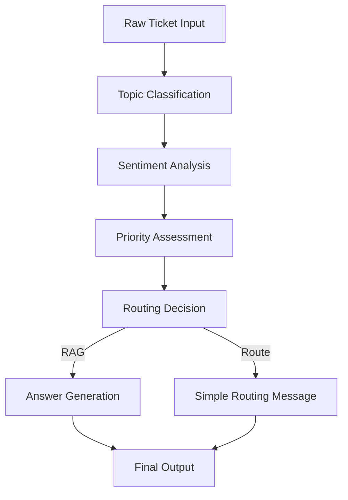

# Assistly

Assistly is an AI-powered customer support pipeline that automates ticket classification, response generation, and knowledge retrieval.  

---

## 🚀 AI Pipeline Components

### 1. Ticket Classification Pipeline
The main intelligence that analyzes incoming tickets and categorizes them:

- **Topic Classification**: Tags tickets with categories such as *How-to, Product, Connector, API/SDK, SSO*, etc.  
- **Sentiment Analysis**: Detects customer emotion (*Frustrated, Curious, Angry, Neutral*).  
- **Priority Assessment**: Determines urgency (*P0/High, P1/Medium, P2/Low*).  

---

### 2. Response Generation Pipeline
Decides how to respond based on classification:

- **RAG (Retrieval-Augmented Generation)**:  
  - For topics like *How-to, Product, Best Practices, API/SDK, SSO*  
  - Searches Atlan's documentation and generates detailed, sourced answers.  
- **Simple Routing**:  
  - For other topics  
  - Generates a basic “routed to appropriate team” message.  

---

### 3. Knowledge Retrieval System
A core part of the RAG pipeline:

- Searches **[Atlan Documentation](https://docs.atlan.com)**  
- Searches **[Atlan Developer Hub](https://developer.atlan.com)**  
- Finds relevant information to answer customer questions  
- Tracks sources for citation  

---

## 📦 Why It's Called a "Pipeline"

Tickets flow through multiple processing stages in sequence:

