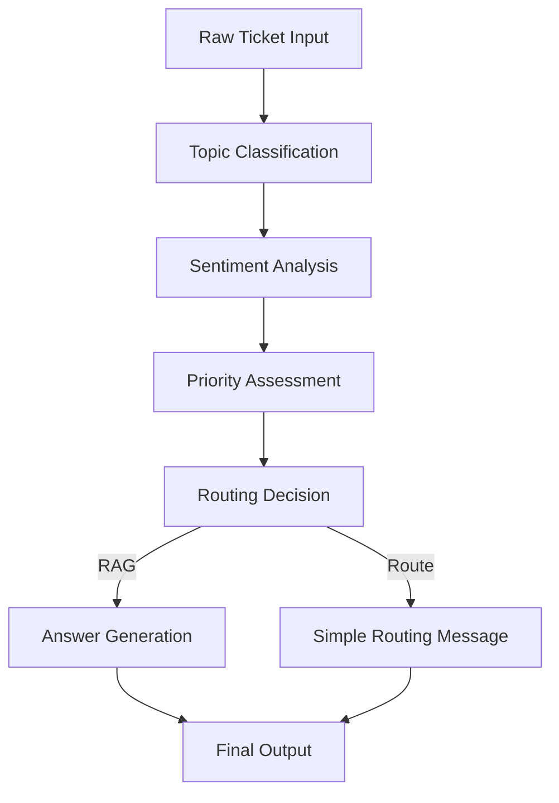

# Atlan Customer Support Copilot

An AI-powered customer support system that automatically classifies tickets and provides intelligent responses using Retrieval-Augmented Generation (RAG) with Atlan's documentation.

## 🌟 Features

### Core Functionality
- **Bulk Ticket Classification**: Automatically classify 30+ sample tickets with AI-powered categorization
- **Interactive AI Agent**: Real-time chat interface for new ticket submission and response
- **Smart Classification**: Topic tags, sentiment analysis, and priority assignment
- **RAG Responses**: Intelligent answers powered by Atlan's documentation
- **Source Citations**: All responses include links to relevant documentation

### Classification Schema
- **Topic Tags**: How-to, Product, Connector, Lineage, API/SDK, SSO, Glossary, Best practices, Sensitive data
- **Sentiment**: Frustrated, Curious, Angry, Neutral
- **Priority**: P0 (High), P1 (Medium), P2 (Low)

## 🏗️ Architecture

```
┌─────────────────┐    ┌──────────────────┐    ┌─────────────────┐
│   Streamlit     │    │   Python         │    │   Databases     │
│   Web App       │    │   AI Pipeline    │    │                 │
├─────────────────┤    ├──────────────────┤    ├─────────────────┤
│ • Dashboard     │◄───┤ • RAG Pipeline   │◄───┤ • MongoDB       │
│ • Chat UI       │    │ • Classification │    │   (Raw docs)    │
│ • Visualizations│    │ • Embeddings     │    │ • Qdrant        │
└─────────────────┘    └──────────────────┘    │   (Vectors)     │
                                               └─────────────────┘
           │                        │                     ▲
           ▼                        ▼                     │
    ┌─────────────┐         ┌─────────────┐              │
    │ OpenAI API  │         │ Firecrawl   │──────────────┘
    │ • GPT-4o    │         │ • Web       │
    │ • FastEmbed │         │   Scraping  │
    └─────────────┘         └─────────────┘
```

## 🛠️ Tech Stack

### AI/ML
- **OpenAI GPT-4o**: LLM for classification and response generation
- **FastEmbed BAAI/bge-small-en-v1.5**: Vector embeddings for semantic search (384 dimensions)
- **Qdrant**: Vector database for RAG retrieval
- **LangChain**: Text processing and chunking

### Application
- **Streamlit**: Interactive web application framework
- **Python**: Core application logic and AI pipeline
- **MongoDB**: Document storage for scraped content

### UI/UX
- **Streamlit Components**: Dashboard and chat interface
- **Custom CSS**: Styled components and responsive design
- **Interactive Elements**: Real-time classification and response generation

### Data Sources
- **docs.atlan.com**: Product documentation
- **developer.atlan.com**: API and SDK documentation
- **Firecrawl**: Web scraping service
- **MongoDB**: Persistent storage for all crawled website data, enabling future retrieval and reprocessing

## 📋 Prerequisites

- Python 3.8+ and pip
- OpenAI API key
- Qdrant Cloud instance
- MongoDB Atlas instance
- Firecrawl API key

## 🚀 Quick Start

### 1. Clone and Setup Environment

```bash
git clone https://github.com/kanugurajesh/Assistly
cd crawling
```

Create `.env` file:
```env
OPENAI_API_KEY=your_openai_api_key
QDRANT_URI=your_qdrant_endpoint
QDRANT_API_KEY=your_qdrant_api_key
MONGODB_URI=your_mongodb_connection_string
FIRECRAWL_API_KEY=your_firecrawl_api_key
```

### 2. Install Dependencies

**Python dependencies:**
```bash
pip install -r app/requirements.txt
```

### 3. Data Pipeline Setup

**Step 1: Scrape Documentation**
```bash
# Scrape developer.atlan.com (already done)
python scrape.py

# Optional: Scrape docs.atlan.com
# Update scrape.py URL and run again
```
*Note: All scraped content is automatically stored in MongoDB for future use and reprocessing without needing to re-crawl the websites.*

**Step 2: Ingest to Vector Database**
```bash
# Process MongoDB documents and create embeddings
python qdrant-ingestion.py
```

### 3. Run the Application

**Run the Streamlit app:**
```bash
cd app
streamlit run main.py
```

Access the application at `http://localhost:8501`

## 📖 Usage Guide

### Dashboard Page
1. Navigate to "📊 Dashboard" in the sidebar
2. Click "Load & Classify All Tickets"
3. View AI-generated classifications for all 30+ sample tickets
4. Analyze summary statistics and topic distributions
5. Search and examine individual ticket classifications

### Interactive Agent Page
1. Navigate to "💬 Chat Agent" in the sidebar
2. Enter your question in the chat interface
3. Toggle "Show internal analysis" to view classification details
4. Get intelligent responses with source citations
5. Try sample questions or submit your own tickets

## 🧠 AI Pipeline Details

### Classification Logic
The system analyzes tickets using structured prompts to generate:
1. **Topic Tags**: Multiple relevant categories
2. **Sentiment**: Emotional tone analysis
3. **Priority**: Business impact assessment

### RAG Response Logic
- **RAG Topics**: How-to, Product, Best practices, API/SDK, SSO → Generate answers using documentation
- **Routing Topics**: Connector, Lineage, Glossary, Sensitive data → Route to appropriate teams

### Chunking Strategy
- **Chunk Size**: 1200 tokens with 200 token overlap
- **Method**: Recursive character splitting with markdown awareness
- **Preservation**: Code blocks, tables, and lists as single units

### Vector Search
- **Embedding Model**: BAAI/bge-small-en-v1.5 (384 dimensions)
- **Search Strategy**: Cosine similarity with score threshold 0.3
- **Top-K Retrieval**: 5 most relevant chunks

## 🔧 Configuration Options

### Environment Variables
- `OPENAI_API_KEY`: Required for AI services
- `QDRANT_URI`: Vector database endpoint
- `QDRANT_API_KEY`: Authentication for Qdrant
- `MONGODB_URI`: Document storage connection
- `FIRECRAWL_API_KEY`: Web scraping service

### Customizable Parameters
- Chunk size and overlap (`qdrant-ingestion.py`)
- Vector search threshold and top-K
- Classification prompt engineering
- Response generation templates

## 📊 Performance Metrics

### Response Quality Measures
- **Source Attribution**: All RAG responses include documentation URLs
- **Relevance Scoring**: Vector similarity scores for retrieved chunks
- **Classification Consistency**: Structured output with validation

### Scalability Features
- **Batch Processing**: Efficient embedding generation
- **Rate Limiting**: API-friendly request handling
- **Error Handling**: Graceful fallbacks and retries

## 🚨 Troubleshooting

### Common Issues

**1. API Rate Limits**
- Implement exponential backoff
- Reduce batch sizes in `qdrant-ingestion.py`

**2. Vector Search Issues**
- Verify Qdrant collection exists
- Check embedding dimensions match (384)
- Validate API credentials

**3. Classification Errors**
- Review prompt templates in `rag_pipeline.py`
- Check JSON parsing logic
- Verify OpenAI API access

### Debugging Tips
- Enable verbose logging in Python scripts
- Check Streamlit console output for errors
- Validate environment variable loading
- Monitor API rate limits and responses

## 🎯 Future Enhancements

### Short-term Improvements
- Add conversation history and context
- Implement user feedback collection
- Enhanced error handling and validation
- Performance optimization for large datasets

### Long-term Roadmap
- Multi-language support
- Advanced analytics dashboard
- Integration with ticketing systems
- Custom model fine-tuning
- Real-time collaboration features

## 📝 Development Notes

### Architecture Decisions
1. **Unified Python Stack**: Streamlit for both UI and AI pipeline for simplicity
2. **Vector Database**: Qdrant chosen for performance and cloud availability
3. **Embedding Strategy**: FastEmbed for efficient local embeddings
4. **Response Generation**: GPT-4o for high-quality responses

### Trade-offs
- **Simplicity vs Scale**: Streamlit for rapid development over complex web frameworks
- **Cost vs Performance**: OpenAI API for quality vs local models for cost
- **Storage vs Compute**: Pre-computed embeddings vs real-time generation
- **Complexity vs Maintainability**: Single codebase with clear separation of concerns

## 🤝 Contributing

1. Fork the repository
2. Create a feature branch
3. Implement changes with tests
4. Update documentation
5. Submit pull request

## 📄 License

[MIT License](LICENSE)

## 🆘 Support

For issues and questions:
1. Check the troubleshooting section
2. Review API documentation
3. Create an issue with detailed reproduction steps

## 🚀 AI Pipeline Components

### 1. Ticket Classification Pipeline
The main intelligence that analyzes incoming tickets and categorizes them:

- **Topic Classification**: Tags tickets with categories such as *How-to, Product, Connector, API/SDK, SSO*, etc.  
- **Sentiment Analysis**: Detects customer emotion (*Frustrated, Curious, Angry, Neutral*).  
- **Priority Assessment**: Determines urgency (*P0/High, P1/Medium, P2/Low*).  

---

### 2. Response Generation Pipeline
Decides how to respond based on classification:

- **RAG (Retrieval-Augmented Generation)**:  
  - For topics like *How-to, Product, Best Practices, API/SDK, SSO*  
  - Searches Atlan's documentation and generates detailed, sourced answers.  
- **Simple Routing**:  
  - For other topics  
  - Generates a basic “routed to appropriate team” message.  

---

### 3. Knowledge Retrieval System
A core part of the RAG pipeline:

- Searches **[Atlan Documentation](https://docs.atlan.com)**  
- Searches **[Atlan Developer Hub](https://developer.atlan.com)**  
- Finds relevant information to answer customer questions  
- Tracks sources for citation  

---

## 📦 Why It's Called a "Pipeline"

Tickets flow through multiple processing stages in sequence:


