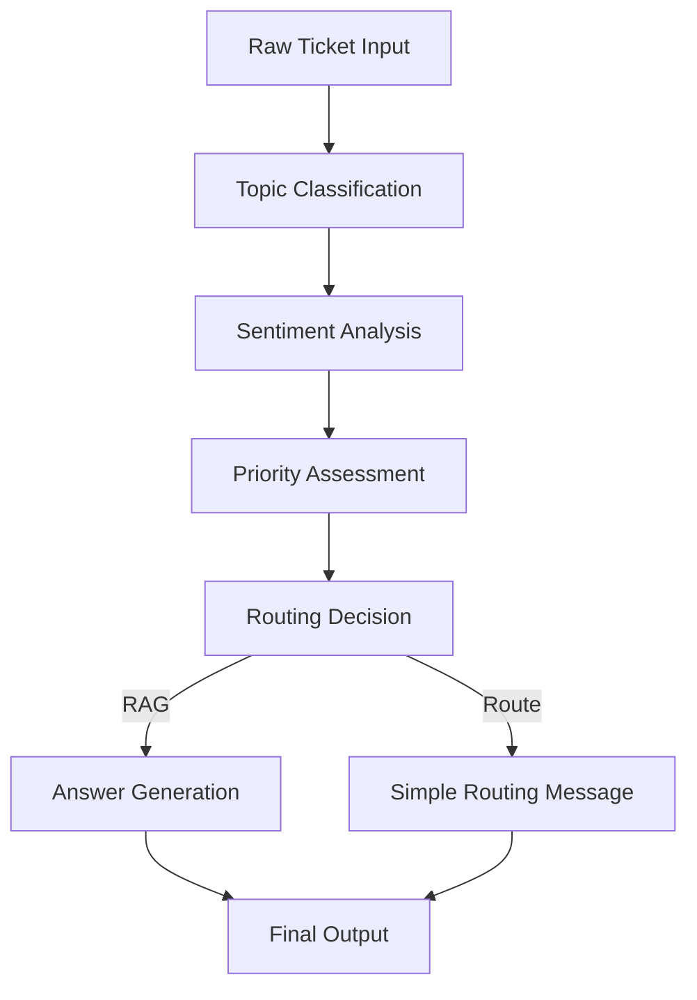

# Atlan Customer Support Copilot

An AI-powered customer support system that automatically classifies tickets and provides intelligent responses using Retrieval-Augmented Generation (RAG) with Atlan's documentation.

## 🌟 Features

### Core Functionality
- **Bulk Ticket Classification**: Automatically classify 30+ sample tickets with AI-powered categorization
- **Interactive AI Agent**: Real-time chat interface for new ticket submission and response
- **Conversational Memory**: Context-aware conversations using LangChain ChatMessageHistory with in-memory storage
- **Smart Classification**: Topic tags, sentiment analysis, and priority assignment
- **RAG Responses**: Intelligent answers powered by Atlan's documentation
- **Source Citations**: All responses include links to relevant documentation

### Classification Schema
- **Topic Tags**: How-to, Product, Connector, Lineage, API/SDK, SSO, Glossary, Best practices, Sensitive data
- **Sentiment**: Frustrated, Curious, Angry, Neutral
- **Priority**: P0 (High), P1 (Medium), P2 (Low)

## 🎯 Major Design Decisions & Trade-offs

### 1. Multi-Stage Pipeline Architecture
**Decision**: Separate data pipeline (scraping → storage → vectorization) from deployment application.

**Why**:
- **Data Persistence**: Web scraping is expensive and rate-limited. MongoDB storage allows reprocessing embeddings without re-scraping.
- **Deployment Flexibility**: App folder contains only deployment dependencies, enabling clean Streamlit Cloud deployment.
- **Development Efficiency**: Can iterate on AI logic without re-running expensive data collection.

**Trade-off**: Increased complexity vs. reliability and cost efficiency.

### 2. Technology Stack Choices

#### Firecrawl vs. Custom Scraping
**Decision**: Firecrawl API for web scraping instead of BeautifulSoup/Scrapy.

**Why**:
- **Content Quality**: Advanced content extraction handles JavaScript, dynamic content, and complex layouts.
- **Rate Limiting**: Built-in respectful crawling with automatic delays.
- **Maintenance**: No need to maintain scraping logic for different website structures.

**Trade-off**: API cost vs. development/maintenance time and content quality.

#### MongoDB + Qdrant vs. Single Database
**Decision**: Dual storage (MongoDB for documents, Qdrant for vectors) vs. single vector database.

**Why**:
- **Data Integrity**: MongoDB preserves original content for reprocessing and debugging.
- **Performance**: Qdrant specializes in vector similarity search with superior performance.
- **Flexibility**: Can change embedding models without losing original documents.
- **Backup Strategy**: Multiple data preservation layers prevent data loss.

**Trade-off**: Infrastructure complexity vs. performance and data safety.

#### OpenAI GPT-4o vs. Local Models
**Decision**: OpenAI GPT-4o for classification and response generation.

**Why**:
- **Quality**: Superior reasoning for complex ticket classification and response generation.
- **JSON Reliability**: Consistent structured output for automated processing.
- **Development Speed**: No model training, fine-tuning, or hosting infrastructure needed.
- **Context Window**: Large context enables conversational memory integration.

**Trade-off**: Ongoing API costs vs. response quality and development speed.

#### FastEmbed BGE-small vs. OpenAI Embeddings
**Decision**: BAAI/bge-small-en-v1.5 (384-dim) via FastEmbed for document embeddings.

**Why**:
- **Cost Efficiency**: Free local embeddings vs. OpenAI embedding API costs.
- **Performance**: 384 dimensions balance quality and storage/compute efficiency.
- **Independence**: No API dependency for vector generation enables batch processing.
- **Privacy**: Document content never leaves local environment.

**Trade-off**: Slightly lower embedding quality vs. significant cost savings and privacy.

### 3. Memory Management Strategy
**Decision**: In-memory conversational history with LangChain vs. database-backed sessions.

**Why**:
- **Simplicity**: No additional database dependencies or infrastructure.
- **Performance**: RAM access for conversation context is instantaneous.
- **Session Isolation**: Natural cleanup when application restarts.
- **Development Speed**: No database schema design or migration concerns.

**Trade-off**: Memory lost on restart vs. infrastructure simplicity and performance.

### 4. User Interface Choice
**Decision**: Streamlit vs. React/Vue.js web application.

**Why**:
- **Rapid Prototyping**: Python-native UI development matches AI pipeline language.
- **Integrated Deployment**: Streamlit Cloud provides seamless hosting for Python apps.
- **Developer Experience**: Single language for entire application stack.
- **Built-in Components**: Chat interfaces, file uploads, and data visualization components.

**Trade-off**: Limited UI customization vs. development speed and deployment simplicity.

### 5. Response Generation Strategy
**Decision**: Hybrid routing (RAG for some topics, simple routing for others).

**Why**:
- **Resource Optimization**: RAG processing only for topics where documentation exists.
- **Response Quality**: Technical topics get detailed, sourced answers.
- **Fallback Strategy**: Non-technical topics route to appropriate human teams.
- **Cost Control**: Expensive vector searches and LLM calls only when beneficial.

**Trade-off**: Complex logic vs. cost efficiency and appropriate response types.

### 6. Data Chunking Strategy
**Decision**: 1200 token chunks with 200 overlap using recursive character splitting.

**Why**:
- **Context Preservation**: Large chunks maintain semantic coherence.
- **Overlap Benefits**: 200-token overlap prevents information loss at boundaries.
- **Markdown Awareness**: Preserves code blocks, tables, and structured content.
- **Token Optimization**: Fits within context windows while maximizing information density.

**Trade-off**: Storage size vs. semantic quality and context preservation.

## 🏗️ Architecture

### Enhanced Data Pipeline & System Architecture

```
                        🌐 DATA COLLECTION LAYER
    ┌─────────────────────────────────────────────────────────────────┐
    │                    Firecrawl Web Scraper                        │
    │  ┌─────────────────┐    ┌─────────────────┐    Rate Limiting    │
    │  │ docs.atlan.com  │    │developer.atlan.c│   & Content       │
    │  │                 │    │om               │   Quality Control   │
    │  └─────────────────┘    └─────────────────┘                     │
    └──────────────────────┬──────────────────────────────────────────┘
                           │ scrape.py
                           ▼
                🗄️ PERSISTENT STORAGE LAYER
    ┌─────────────────────────────────────────────────────────────────┐
    │                      MongoDB Atlas                              │
    │  ┌─────────────────┐  ┌─────────────────┐  ┌─────────────────┐  │
    │  │   Raw Content   │  │    Metadata     │  │  Backup Files   │  │
    │  │   • HTML Text   │  │  • URLs         │  │  • JSON Export  │  │
    │  │   • Structure   │  │  • Timestamps   │  │  • Recovery     │  │
    │  │   • Clean Text  │  │  • Source Info  │  │    Data         │  │
    │  └─────────────────┘  └─────────────────┘  └─────────────────┘  │
    └──────────────────────┬──────────────────────────────────────────┘
                           │ qdrant_ingestion.py
                           ▼
                  🧠 VECTOR PROCESSING LAYER
    ┌─────────────────────────────────────────────────────────────────┐
    │                    Text Processing Pipeline                     │
    │  ┌─────────────────┐  ┌─────────────────┐  ┌─────────────────┐  │
    │  │   Chunking      │  │   Embeddings    │  │ Vector Storage  │  │
    │  │ • 1200 tokens   │→ │ • BGE-small     │→ │ • Qdrant Cloud  │  │
    │  │ • 200 overlap   │  │ • 384 dims      │  │ • Similarity    │  │
    │  │ • Markdown      │  │ • Local Gen     │  │ • Collections   │  │
    │  └─────────────────┘  └─────────────────┘  └─────────────────┘  │
    └──────────────────────────────────┬──────────────────────────────┘
                                       │
                                       ▼
                        🤖 AI PROCESSING LAYER
    ┌─────────────────────────────────────────────────────────────────┐
    │                      OpenAI GPT-4o                              │
    │  ┌─────────────────┐  ┌─────────────────┐  ┌─────────────────┐  │
    │  │Classification   │  │  RAG Response   │  │ Memory Context  │  │
    │  │• Topic Tags     │  │ • Doc Retrieval │  │• Session State  │  │
    │  │• Sentiment      │  │ • Answer Gen    │  │• Chat History   │  │
    │  │• Priority       │  │ • Citations     │  │• Conversation   │  │
    │  └─────────────────┘  └─────────────────┘  └─────────────────┘  │
    └──────────────────────┬──────────────────────┬────────────────── ┘
                           │                      │
                           ▼                      ▼
                       🖥️ APPLICATION LAYER (main.py)
    ┌─────────────────────────────────────────────────────────────────┐
    │                    Streamlit Web Application                    │
    │  ┌─────────────────┐  ┌─────────────────┐  ┌─────────────────┐  │
    │  │   Dashboard     │  │   Chat Agent    │  │   Analytics     │  │
    │  │ • Bulk Process  │  │ • Real-time     │  │ • Performance   │  │
    │  │ • 30+ Tickets   │  │ • Memory        │  │ • Metrics       │  │
    │  │ • Statistics    │  │ • Citations     │  │ • Usage Stats   │  │
    │  └─────────────────┘  └─────────────────┘  └─────────────────┘  │
    └─────────────────────────────────────────────────────────────────┘

        🔄 DATA FLOW DIRECTIONS:
        scrape.py        → MongoDB (Document Storage)
        qdrant_ingestion.py → Qdrant (Vector Processing)
        main.py          → All Services (Real-time Queries)

        ⚡ ERROR HANDLING & RECOVERY:
        • MongoDB backup files for data recovery
        • Incremental processing to handle failures
        • Rate limiting and retry logic
        • Graceful degradation for service outages
```

### System Components
- **Data Pipeline** (Root scripts): Web scraping → Storage → Vector preparation
- **Deployment** (App folder): Streamlit application with AI capabilities
- **AI Services**: OpenAI for classification and response generation
- **Storage**: MongoDB for documents, Qdrant for vector search

## 🛠️ Tech Stack

### AI/ML
- **OpenAI GPT-4o**: LLM for classification and response generation
- **FastEmbed BAAI/bge-small-en-v1.5**: Vector embeddings for semantic search (384 dimensions)
- **Qdrant**: Vector database for RAG retrieval
- **LangChain**: Text processing, chunking, and conversational memory management

### Application
- **Streamlit**: Interactive web application framework
- **Python**: Core application logic and AI pipeline
- **MongoDB**: Document storage for scraped content

### UI/UX
- **Streamlit Components**: Dashboard and chat interface
- **Custom CSS**: Styled components and responsive design
- **Interactive Elements**: Real-time classification and response generation

### Data Sources & Pipeline
- **Firecrawl API**: Automated web scraping service for documentation
- **docs.atlan.com**: Product documentation and user guides
- **developer.atlan.com**: API and SDK documentation
- **MongoDB**: Persistent storage for all scraped content with metadata
- **Qdrant**: Vector database for semantic search and RAG retrieval

### Pipeline Stages
1. **Web Scraping**: Firecrawl crawls documentation sites and extracts content
2. **Document Storage**: Raw content stored in MongoDB with full metadata
3. **Vector Processing**: Content chunked and embedded using FastEmbed BGE-small
4. **RAG Deployment**: Streamlit app queries Qdrant for relevant context

## 📋 Prerequisites

### For Deployment (Streamlit App)
- Python 3.8+ and pip
- OpenAI API key
- Qdrant Cloud instance (vector database)
- MongoDB Atlas instance (document storage)
- Firecrawl API key (if running custom scraping)

### Project Structure
- **Root directory**: Data pipeline scripts (scrape.py, qdrant_ingestion.py)
- **app/ directory**: Streamlit deployment application with own requirements and .env

## 🚀 Quick Start

### 1. Clone and Setup Environment

```bash
git clone https://github.com/kanugurajesh/Assistly
cd Assistly
```

**Project Structure Overview:**
```
crawling/
├── app/                    # Streamlit deployment
│   ├── main.py            # Main Streamlit application
│   ├── rag_pipeline.py    # AI pipeline implementation
│   ├── requirements.txt   # App dependencies
│   ├── .env.example       # Environment template
│   └── sample_tickets.json
├── memory_manager.py      # Conversational memory management
├── scrape.py              # Firecrawl web scraping
├── qdrant_ingestion.py    # Vector database ingestion
├── requirements.txt       # Data pipeline dependencies
└── README.md
```

Create `.env` file in the `app/` directory (copy from `app/.env.example`):
```env
OPENAI_API_KEY=your_openai_api_key
QDRANT_URI=your_qdrant_cloud_endpoint
QDRANT_API_KEY=your_qdrant_api_key
MONGODB_URI=your_mongodb_atlas_connection_string
FIRECRAWL_API_KEY=your_firecrawl_api_key
```

### 2. Install Dependencies

**For deployment (Streamlit app):**
```bash
pip install -r app/requirements.txt
```

**For data pipeline (if running scraping/ingestion):**
```bash
pip install -r requirements.txt
```

### 3. Data Pipeline Setup (Optional - for custom data)

**Step 1: Web Scraping with Firecrawl**
```bash
# Basic scraping (pre-completed for Atlan docs)
python scrape.py https://docs.atlan.com --limit 700
python scrape.py https://developer.atlan.com --limit 300

# Custom scraping examples
python scrape.py https://your-docs.com --limit 500 --collection custom_docs
```
*All scraped content automatically stored in MongoDB with metadata and backup files.*

**Step 2: Vector Database Ingestion**
```bash
# Basic ingestion (processes all documents)
python qdrant_ingestion.py

# Advanced ingestion with filtering (see Advanced Pipeline Options below)
python qdrant_ingestion.py --source-url "https://docs.atlan.com"
```
*Chunks documents using LangChain, creates embeddings with FastEmbed BGE-small, stores in Qdrant.*

**Note**: The application comes with pre-processed data, so this step is only needed for custom datasets or updates. For advanced configuration options, see the "Advanced Pipeline Options" section below.

## 🔧 Advanced Pipeline Options

### Scraping Configuration (scrape.py)

**Basic Command Structure:**
```bash
python scrape.py <URL> [OPTIONS]
```

**Available Options:**
- `--limit <number>`: Maximum pages to crawl (default: 700)
- `--collection <name>`: MongoDB collection name (default: atlan_developer_docs)

**Common Scraping Scenarios:**
```bash
# Scrape with custom page limit
python scrape.py https://docs.atlan.com --limit 500

# Scrape to custom MongoDB collection
python scrape.py https://docs.atlan.com --collection custom_docs

# Scrape developer docs with different limits
python scrape.py https://developer.atlan.com --limit 200 --collection dev_docs
```

### Ingestion Configuration (qdrant_ingestion.py)

**Advanced Command Structure:**
```bash
python qdrant_ingestion.py [OPTIONS]
```

**Available Options:**
- `--source-url <url>`: Filter documents by specific source URL
- `--collection <name>`: MongoDB collection name (default: atlan_developer_docs)
- `--qdrant-collection <name>`: Qdrant collection name (default: atlan_docs)
- `--recreate`: Delete and recreate Qdrant collection (removes existing data)
- `--no-incremental`: Process all documents (skip duplicate checking)

**Advanced Ingestion Examples:**
```bash
# Process only developer documentation
python qdrant_ingestion.py --source-url "https://developer.atlan.com"

# Process only general documentation
python qdrant_ingestion.py --source-url "https://docs.atlan.com"

# Recreate collection (fresh start)
python qdrant_ingestion.py --recreate

# Process all documents without incremental checking
python qdrant_ingestion.py --no-incremental

# Process custom collection with filtering
python qdrant_ingestion.py --collection custom_docs --source-url "https://example.com"

# Create custom Qdrant collection
python qdrant_ingestion.py --qdrant-collection "developer_vectors"

# Process custom MongoDB collection to custom Qdrant collection
python qdrant_ingestion.py --collection dev_docs --qdrant-collection "dev_vectors"

# Full rebuild with specific source and custom collection
python qdrant_ingestion.py --recreate --source-url "https://developer.atlan.com" --qdrant-collection "dev_only"
```

## 📂 Document Filtering & Collection Management

### Source URL Filtering Benefits

**Selective Processing:**
- Update only specific documentation domains
- Test pipeline with subset of data
- Separate processing schedules for different sites

**Document Type Classification:**
- Automatic categorization: `developer.atlan.com` → "developer" type
- All other sources → "docs" type
- Enables filtered search and analytics

**Performance Optimization:**
- Process only changed documentation
- Reduce vector database update time
- Minimize embedding generation costs

**Custom Qdrant Collections:**
- Separate vector collections for different projects
- Independent collection lifecycle management
- Isolated testing and production environments
- Multiple documentation versions in parallel

### Collection Management Workflows

**Development & Testing:**
```bash
# Create test collection with limited data
python scrape.py https://docs.atlan.com --limit 50 --collection test_docs
python qdrant_ingestion.py --collection test_docs --qdrant-collection test_vectors --recreate
```

**Production Updates:**
```bash
# Incremental update (default behavior)
python qdrant_ingestion.py --source-url "https://docs.atlan.com"

# Full rebuild when needed
python qdrant_ingestion.py --recreate
```

**Multi-Source Management:**
```bash
# Separate ingestion for different documentation types
python qdrant_ingestion.py --source-url "https://developer.atlan.com"
python qdrant_ingestion.py --source-url "https://docs.atlan.com"
```

### Incremental Processing

**How It Works:**
- Checks MongoDB document IDs already in Qdrant
- Skips processing of existing documents
- Only processes new or updated content

**When to Use `--no-incremental`:**
- After modifying chunking parameters
- When reprocessing is needed due to embedding model changes
- For debugging or validation purposes

### 4. Run the Application

**Run the Streamlit app:**
```bash
cd app
streamlit run main.py
```

The application will open automatically in your browser at `http://localhost:8501`

### 5. Streamlit Deployment

**Deploy to Streamlit Community Cloud:**
1. Push your repository to GitHub
2. Visit [share.streamlit.io](https://share.streamlit.io)
3. Connect your GitHub repository
4. Set main file path: `app/main.py`
5. Add environment variables in Streamlit Cloud settings
6. Deploy your application

## 📖 Usage Guide

### Dashboard Page
1. Navigate to "📊 Dashboard" in the sidebar
2. Click "Load & Classify All Tickets"
3. View AI-generated classifications for all 30+ sample tickets
4. Analyze summary statistics and topic distributions
5. Search and examine individual ticket classifications

### Interactive Agent Page
1. Navigate to "💬 Chat Agent" in the sidebar
2. Enter your question in the chat interface
3. Toggle "Show internal analysis" to view classification details
4. Get intelligent responses with source citations
5. Experience context-aware conversations with memory
6. Use the "Conversation Management" sidebar to view memory stats or clear history
7. Try sample questions or submit your own tickets

## 💬 Conversational Memory Features

### Context-Aware Conversations
The system maintains conversation history to provide context-aware responses:
- **Follow-up Questions**: Ask related questions without repeating context
- **Reference Previous Answers**: The AI remembers what it told you earlier
- **Natural Flow**: Conversations feel more natural and coherent

### Memory Management
**Conversation Management Sidebar:**
- **Memory Statistics**: View active sessions and total message count
- **Current Session Info**: See number of exchanges in current conversation
- **Clear History**: Manually reset conversation memory when needed

**Automatic Features:**
- **Session Isolation**: Each browser session has its own conversation memory
- **Message Limits**: Automatically trims to last 20 messages to prevent token overflow
- **Auto Expiry**: Sessions expire after 60 minutes of inactivity
- **Smart Trimming**: Removes oldest messages while preserving conversation pairs

### Example Conversation Flow
```
User: "How do I connect Snowflake to Atlan?"
AI: "To connect Snowflake to Atlan, you need to configure..." [provides detailed steps]

User: "What permissions do I need for this?"
AI: "For the Snowflake connection we discussed, you'll need..." [remembers previous context]

User: "Are there any security considerations?"
AI: "Yes, for your Snowflake-Atlan integration, consider..." [builds on conversation]
```

### Technical Implementation
- **Backend**: LangChain's `InMemoryChatMessageHistory` for pure RAM storage
- **No Database**: Conversations stored in Python dictionaries (no external dependencies)
- **Session Management**: UUID-based session identification with Streamlit session state
- **Context Integration**: Previous conversation included in RAG prompts for better responses

## 🧠 AI Pipeline Details

### Classification Logic
The system analyzes tickets using structured prompts to generate:
1. **Topic Tags**: Multiple relevant categories
2. **Sentiment**: Emotional tone analysis
3. **Priority**: Business impact assessment

### RAG Response Logic
- **RAG Topics**: How-to, Product, Best practices, API/SDK, SSO → Generate answers using documentation with conversation context
- **Routing Topics**: Connector, Lineage, Glossary, Sensitive data → Route to appropriate teams
- **Memory Integration**: Previous conversation history included in prompts for context-aware responses

### Chunking Strategy
- **Chunk Size**: 1200 tokens with 200 token overlap
- **Method**: Recursive character splitting with markdown awareness
- **Preservation**: Code blocks, tables, and lists as single units

### Vector Search
- **Embedding Model**: BAAI/bge-small-en-v1.5 (384 dimensions)
- **Search Strategy**: Cosine similarity with score threshold 0.3
- **Top-K Retrieval**: 5 most relevant chunks

### Conversational Memory System
- **Memory Backend**: LangChain's `InMemoryChatMessageHistory` for pure RAM storage
- **Session Management**: Unique session IDs for each browser session with automatic timeout
- **Context Window**: Last 5 message exchanges included in RAG prompts for continuity
- **Memory Features**:
  - Automatic message trimming (max 20 messages per session)
  - Session cleanup and expiration (60-minute timeout)
  - Manual conversation clearing via UI
  - Memory usage statistics and monitoring
- **No External Dependencies**: Pure in-memory storage without databases

## 🔧 Configuration Options

### Environment Variables (app/.env)
- `OPENAI_API_KEY`: Required for GPT-4o classification and response generation
- `QDRANT_URI`: Qdrant Cloud vector database endpoint
- `QDRANT_API_KEY`: Authentication for Qdrant Cloud instance
- `MONGODB_URI`: MongoDB Atlas connection string for document storage
- `FIRECRAWL_API_KEY`: Firecrawl API key for web scraping (data pipeline only)

### Data Pipeline Configuration
- **Scraping Parameters**: Use `--limit` and `--collection` options in scrape.py for custom URLs and crawl limits
- **Source Filtering**: Use `--source-url` in qdrant_ingestion.py for selective document processing
- **Collection Management**: Use `--qdrant-collection`, `--recreate` and `--no-incremental` options for collection lifecycle
- **Custom Collections**: Use `--qdrant-collection` to create separate vector collections for different projects
- **Chunk Configuration**: Adjust size and overlap in qdrant_ingestion.py (default: 1200 tokens, 200 overlap)
- **Vector Search**: Modify threshold and top-K in app/rag_pipeline.py (default: 0.3 threshold, 5 chunks)

### Common Pipeline Workflows

**Complete Fresh Setup:**
```bash
# Scrape new documentation
python scrape.py https://new-docs.com --limit 500 --collection new_docs

# Create fresh vector database
python qdrant_ingestion.py --collection new_docs --recreate
```

**Incremental Updates (Recommended):**
```bash
# Re-scrape updated content (overwrites existing URLs)
python scrape.py https://docs.atlan.com --limit 700

# Incremental ingestion (only new/changed documents)
python qdrant_ingestion.py
```

**Domain-Specific Processing:**
```bash
# Update only developer documentation vectors
python qdrant_ingestion.py --source-url "https://developer.atlan.com"

# Update only general documentation vectors
python qdrant_ingestion.py --source-url "https://docs.atlan.com"
```

**Testing and Development:**
```bash
# Create test dataset
python scrape.py https://docs.atlan.com --limit 20 --collection test_data

# Test ingestion pipeline with custom Qdrant collection
python qdrant_ingestion.py --collection test_data --qdrant-collection test_vectors --recreate
```

**Multiple Project Management:**
```bash
# Project A: Customer documentation
python scrape.py https://customer-docs.com --collection customer_docs
python qdrant_ingestion.py --collection customer_docs --qdrant-collection customer_vectors

# Project B: Internal documentation
python scrape.py https://internal-docs.com --collection internal_docs
python qdrant_ingestion.py --collection internal_docs --qdrant-collection internal_vectors
```

### Application Customization
- **Classification Prompts**: Edit prompts in app/rag_pipeline.py for custom categorization
- **Response Templates**: Modify RAG and routing responses in app/main.py
- **UI Styling**: Update custom CSS in app/main.py for branding

## 📊 Performance Metrics

### Data Pipeline Efficiency
- **Firecrawl Scraping**: Automated content extraction with metadata preservation
- **MongoDB Storage**: Reliable document persistence with backup capabilities
- **Vector Ingestion**: Efficient batch processing of embeddings to Qdrant

### Response Quality Measures
- **Source Attribution**: All RAG responses include original documentation URLs
- **Relevance Scoring**: Vector similarity scores for retrieved chunks (threshold 0.3)
- **Classification Consistency**: Structured JSON output with validation
- **Context Quality**: 5 most relevant chunks retrieved for comprehensive answers

### Scalability Features
- **Persistent Storage**: MongoDB enables data reprocessing without re-scraping
- **Vector Database**: Qdrant Cloud provides fast similarity search at scale
- **Rate Limiting**: API-friendly request handling for OpenAI and Firecrawl
- **Error Handling**: Graceful fallbacks and retries across the pipeline

## 🚨 Troubleshooting

### Data Pipeline Issues

**1. Firecrawl Scraping Problems**
- Verify Firecrawl API key in environment variables
- Check rate limits and adjust scraping delays in scrape.py
- Monitor MongoDB connection for storage issues

**2. MongoDB Storage Issues**
- Validate MongoDB Atlas connection string
- Check database and collection permissions
- Verify network access to MongoDB cluster

**3. Vector Database Problems**
- Verify Qdrant Cloud instance is accessible
- Check embedding dimensions match (384 for BGE-small)
- Validate collection exists and has correct configuration

### Application Issues

**4. Streamlit Deployment**
- Ensure all environment variables are set in app/.env
- Check that app/requirements.txt includes all dependencies
- Verify OpenAI API key has sufficient credits

**5. Classification Errors**
- Review prompt templates in app/rag_pipeline.py
- Check JSON parsing logic for malformed responses
- Monitor OpenAI API rate limits

### Debugging Tips
- Check Streamlit logs for detailed error messages
- Validate environment variable loading in app directory
- Test individual pipeline components (MongoDB, Qdrant, OpenAI)
- Monitor API usage and rate limits across all services

## 🎯 Future Enhancements

### Short-term Improvements
- ✅ **Conversational Memory**: Context-aware conversations with LangChain ChatMessageHistory
- Implement user feedback collection
- Enhanced error handling and validation
- Performance optimization for large datasets

### Long-term Roadmap
- Multi-language support
- Advanced analytics dashboard
- Integration with ticketing systems
- Custom model fine-tuning
- Real-time collaboration features

## 📝 Development Notes

### Project Structure Philosophy
- **Separation of Concerns**: Data pipeline (root) vs application deployment (app/)
- **Environment Isolation**: Each tier has its own requirements and configuration
- **Data Persistence**: MongoDB enables reprocessing without re-scraping expensive operations
- **Deployment Ready**: app/ folder contains everything needed for Streamlit Cloud deployment

### Architecture Decisions
1. **Complete Data Pipeline**: Firecrawl → MongoDB → Qdrant → Streamlit for end-to-end automation
2. **Unified Python Stack**: Streamlit for both UI and AI pipeline for simplicity
3. **Vector Database**: Qdrant Cloud chosen for performance and scalability
4. **Embedding Strategy**: FastEmbed BGE-small for efficient 384-dim embeddings
5. **Response Generation**: OpenAI GPT-4o for high-quality responses
6. **Data Persistence**: MongoDB for reliable document storage and backup

### Trade-offs
- **Simplicity vs Scale**: Streamlit for rapid development over complex web frameworks
- **Cost vs Performance**: OpenAI GPT-4o for quality vs local models for cost
- **Storage vs Compute**: Pre-computed embeddings vs real-time generation
- **Flexibility vs Complexity**: Multi-stage pipeline (scrape → store → vectorize → deploy)
- **Data Persistence**: MongoDB storage ensures data availability and reprocessing capability

## 🤝 Contributing

1. Fork the repository
2. Create a feature branch
3. Implement changes with tests
4. Update documentation
5. Submit pull request

## 📄 License

[MIT License](LICENSE)

## 🆘 Support

For issues and questions:
1. Check the troubleshooting section
2. Review API documentation
3. Create an issue with detailed reproduction steps

## 🚀 AI Pipeline Components

### 1. Ticket Classification Pipeline
The main intelligence that analyzes incoming tickets and categorizes them:

- **Topic Classification**: Tags tickets with categories such as *How-to, Product, Connector, API/SDK, SSO*, etc.  
- **Sentiment Analysis**: Detects customer emotion (*Frustrated, Curious, Angry, Neutral*).  
- **Priority Assessment**: Determines urgency (*P0/High, P1/Medium, P2/Low*).  

---

### 2. Response Generation Pipeline
Decides how to respond based on classification:

- **RAG (Retrieval-Augmented Generation)**:  
  - For topics like *How-to, Product, Best Practices, API/SDK, SSO*  
  - Searches Atlan's documentation and generates detailed, sourced answers.  
- **Simple Routing**:  
  - For other topics  
  - Generates a basic “routed to appropriate team” message.  

---

### 3. Knowledge Retrieval System
A core part of the RAG pipeline:

- Searches **[Atlan Documentation](https://docs.atlan.com)**  
- Searches **[Atlan Developer Hub](https://developer.atlan.com)**  
- Finds relevant information to answer customer questions  
- Tracks sources for citation  

---

## 📦 Why It's Called a "Pipeline"

Tickets flow through multiple processing stages in sequence:



<div>
    <a href="https://www.loom.com/share/8793e1e582dd400c947492cb4af3c863">
    </a>
    <a href="https://www.loom.com/share/8793e1e582dd400c947492cb4af3c863">
      
    </a>
</div>
